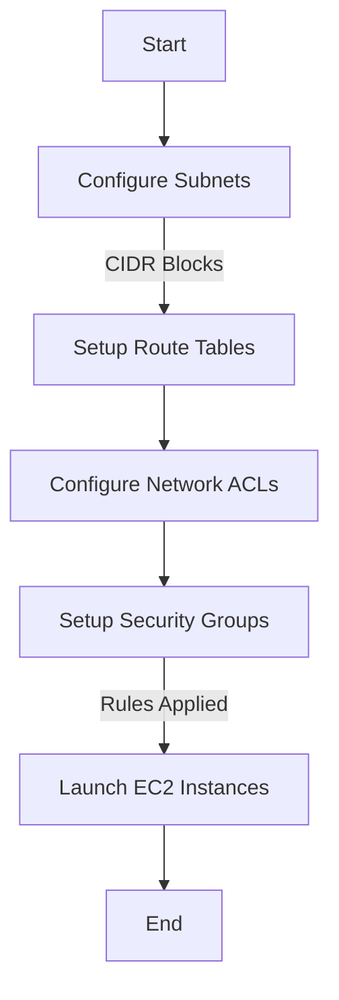
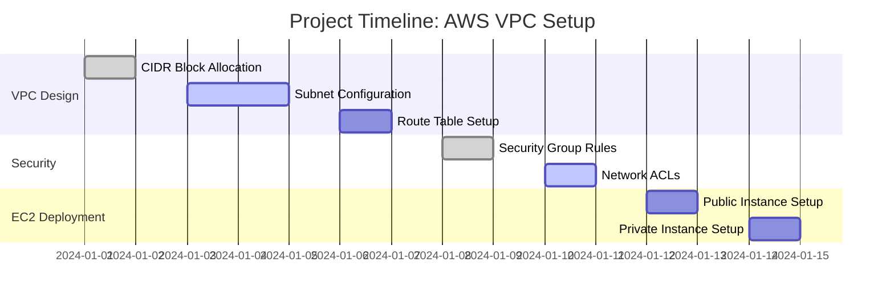

# Launching-VPC-Resources  

# 🚀 Legendary AWS Networks: EC2 & VPC Resources  

Welcome to the **Legendary AWS Networks Project**, where we explore the power of **Amazon Virtual Private Cloud (VPC)** and **EC2 instances** to create secure, scalable, and customizable network architectures. Designed by **Brian Kimemia Njeri**, this guide walks through the steps of configuring a VPC, setting up EC2 instances, and optimizing security and access.

---

## 🌐 What is Amazon VPC?

**Amazon Virtual Private Cloud (VPC)** allows you to create a logically isolated section in the AWS Cloud, providing complete control over networking:
- **Customizable IP Addressing**: CIDR block configurations.
- **Subnets**: Public and private.
- **Routing Tables & Security**: Network ACLs, security groups, and route optimizations.

### How I Used Amazon VPC:
1. **Designed secure network environments** for AWS resources.
2. Configured **public and private subnets** for resource isolation.
3. Created **custom route tables** and **network ACLs** for optimized data flow.

---

## 🛠️ Key Features

### 🚀 EC2 Instance Deployment
- **Direct VM Access**:
  - Configured SSH (Linux) and RDP (Windows) for direct management.
  - Generated key pairs for secure authentication.
- **File Format**: PEM for private key security.

### 🌐 Public and Private Servers
- **Public Server**:
  - Updated security groups and inbound/outbound rules.
  - Enabled external access while maintaining secure configurations.
- **Private Server**:
  - Restricted access to sensitive resources.
  - Allowed traffic only from the public server’s security group.

---

## 📊 VPC Architecture: Visualized

### 🖼️ VPC Resource Map
Here’s an overview of the VPC architecture:

```mermaid
graph TD
    A[VPC (10.0.0.0/16)] --> B[Public Subnet (10.0.0.0/24)]
    A --> C[Private Subnet (10.0.1.0/24)]
    B --> D[Public Server]
    C --> E[Private Server]
    B --> F[NAT Gateway]
    F --> G[External World]
    C --> F
```

 
# 🛡️ Security Optimizations
Key Configurations
### Network ACLs:
Defined inbound and outbound traffic rules for subnets.
Ensured isolation between public and private subnets.
### Security Groups:
Public server: Opened only necessary ports (e.g., 22 for SSH, 80 for HTTP).
Private server: Allowed traffic exclusively from the public server.
Security Flowchart


# 🚀 Speeding Up VPC Creation
Alternate Method
Created a VPC (CIDR block: 10.0.0.0/16).
Added public (10.0.0.0/24) and private subnets (10.0.1.0/24).


Configured a custom route table for efficient traffic flow.
Established NAT Gateways for private subnet internet access.
### Tips for Efficiency:
Use VPC resource maps to visualize architecture.
Set up NAT Gateways for secure internet access in private subnets.
# 📈 Project Timeline
Gantt Chart Representation

# 📚 Key Takeaways
Lessons Learned:
Importance of Planning: CIDR block allocation impacts subnet scalability.
Security Is Key: Proper configuration of ACLs and security groups ensures system integrity.
Efficiency Tools: VPC resource maps simplify network management.
# 📬 Contact
For any questions, reach out:

Brian Kimemia Njeri
Website: [Portfolio](https://briankimemia.vercel.app/)

```vbnet

This `README.md` creatively integrates visuals and flowcharts for a professional presentation.
